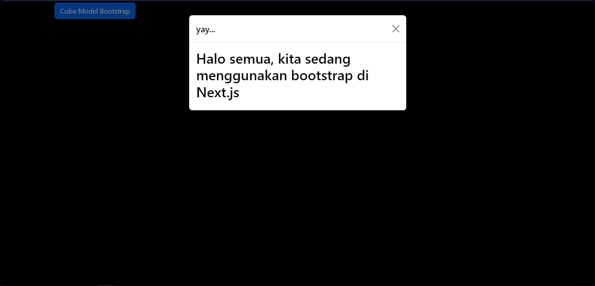
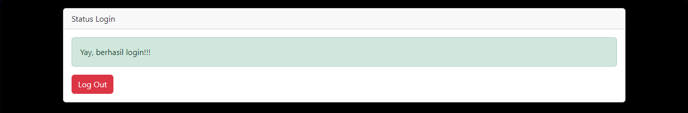
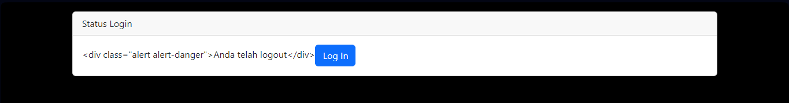
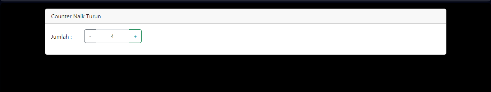

|  | Pemrograman Berbasis Framework 2024 |
|--|--|
| NIM |  2341728026|
| Nama |  Anwar Alif Katresna |
| Kelas | TI - 3A |

## Praktikum 1: Mendefinisikan Komponen
Coba kita jalankan project next.js kita, dan laporkan apa yang terjadi?
 

Muncul tampilan dengan button "Coba Model Bootstrap", lalu muncul tulisan "yay... dan Halo semua, kita sedang menggunakan bootstrap di Next.js".

## Praktikum 2: Contoh Login dengan Redux  
Coba akses http://localhost:3000/login, dan klik tombol login. Kemudian lakukan refresh page berkali-kali (jika perlu restart npm run dev nya). Simpulkan apa yang terjadi ?

Setelah melakukan refresh page berkali-kali, maka akan muncul pesan "Yay, berhasil login !!!" dan apabila logout maka akan muncul pesan "Anda telah logout". Hal ini terjadi karena kita menggunakan Redux untuk menyimpan data login dan logout sehingga data tersebut tidak akan hilang ketika kita melakukan refresh page atau restart npm run dev nya.

Baris 25 dan 30 terdapat method parse(), apa yang terjadi jika kita tidak menggunakan method tersebut?

Jika kita tidak menggunakan method parse(), maka akan muncul tampilan mentahan dari div karena parse digunakan untuk mengubah string menjadi objek.

## Praktikum 3: Membuat Aplikasi Counter Sederhana
kita jalankan di browser dengan url localhost:3000/counter, dan amati apa yang terjadi?
 

##  Tugas (Pertanyaan Praktikum)
Berdasarkan pada praktikum sebelumnya yang telah dilakukan, beberapa pertanyaan terkait praktikum perlu diselesaikan yaitu sebagai berikut.
1. Apa kegunaan dari kode ini import { useEffect } from "react"; Pada file pages/_app.tsx? jelaskan
useEffect adalah hooks yang digunakan untuk melakukan side effect pada functional component. Side effect adalah efek yang terjadi di luar komponen, seperti mengambil data dari server, manipulasi DOM, dll. useEffect akan dijalankan setiap kali komponen di render. useEffect memiliki 2 parameter, parameter pertama adalah fungsi yang akan dijalankan, dan parameter kedua adalah array yang berisi dependency dari fungsi tersebut. Jika array tersebut kosong, maka fungsi tersebut akan dijalankan hanya sekali ketika komponen di render. Jika array tersebut berisi state atau props, maka fungsi tersebut akan dijalankan ketika state atau props tersebut berubah.
2. Jika pada file pages/_app.tsx kita tidak menggunakan useEffect, menghapus baris 3, dan baris 9-11, apa yang akan terjadi?
Jika useEffect dihapus, maka bootstrap tidak akan berjalan karena useEffect digunakan untuk memanggil bootstrap.min.js yang berfungsi untuk menjalankan javascript dari bootstrap. Sehingga bootstrap tidak akan berjalan dan tampilan akan berubah.
3. Mengapa di react/nextjs penulisan tag html untuk class, harus diganti menjadi className ?
Karena class adalah keyword di javascript, sehingga jika kita menggunakan class pada tag html, maka akan terjadi error. Sehingga kita harus mengganti class menjadi className agar tidak terjadi error.
4. Apakah store pada nextjs bisa menyimpan banyak redux reducer?
Ya, store pada nextjs bisa menyimpan banyak redux reducer. Redux reducer adalah fungsi yang digunakan untuk mengubah state pada store. Redux reducer bisa digunakan untuk mengubah state pada store yang berbeda, sehingga store pada nextjs bisa menyimpan banyak redux reducer.
5. Jelaskan kegunaan dari file store.js!
store.js adalah file yang digunakan untuk membuat store pada nextjs. Store adalah tempat penyimpanan state pada nextjs. Store pada nextjs menggunakan redux, sehingga store.js digunakan untuk membuat store redux pada nextjs. Store.js berisi kode untuk membuat store redux, seperti membuat reducer, membuat store, dan menyediakan store tersebut ke aplikasi.
6. Pada file pages/login.tsx, apa maksud dari kode ini ?
const { isLogin } = useSelector((state) => state.auth);  
Kode diatas digunakan untuk mengambil state isLogin dari store redux. useSelector adalah hooks yang digunakan untuk mengambil state dari store redux. Kode diatas akan mengambil state isLogin dari store redux, sehingga kita bisa menggunakan state isLogin pada komponen tersebut.
7. Pada file pages/counter.tsx, apa maksud dari kode ini?
const {totalCounter} = useSelector((state) => state.counter);
Kode diatas digunakan untuk mengambil state totalCounter dari store redux. useSelector adalah hooks yang digunakan untuk mengambil state dari store redux. Kode diatas akan mengambil state totalCounter dari store redux, sehingga kita bisa menggunakan state totalCounter pada komponen tersebut.

